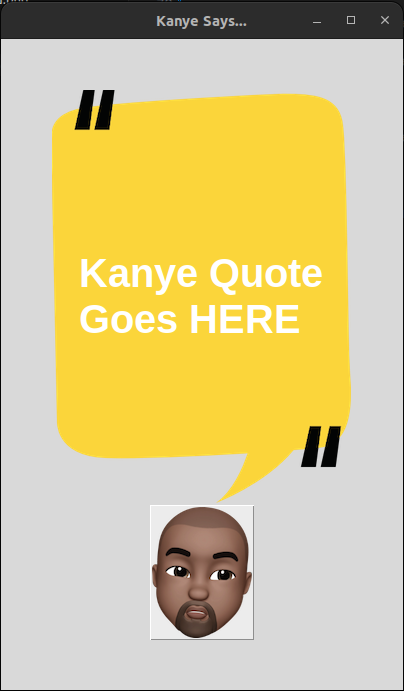

# Kanye West Quote Generator (Tkinter GUI)

A fun Python application that fetches and displays random Kanye West quotes in a visually appealing **Tkinter** window.  
Powered by the [Kanye REST API](https://api.kanye.rest).

---

## 📌 Features
- Fetches a random Kanye West quote with a single click.
- Uses a clean, image-based GUI built with Tkinter.
- Minimal setup — works on most systems with Python installed.
- Error handling for network issues.

---

## 🛠 Requirements
- Python **3.6+**
- [`requests`](https://pypi.org/project/requests/) library
- `tkinter` (comes pre-installed with most Python distributions)
- Two image files in the same folder as `main.py`:
  - `background.png` — the app's background image
  - `kanye.png` — the Kanye button image

---

## 📥 Installation

1. **Clone this repository**:
   ```bash
   git clone https://github.com/your-username/Kanye_API_Quotes.git
   cd Kanye_API_Quotes


2. **(Optional) Create and activate a virtual environment**:

    python3 -m venv env 
    source env/bin/activate  # On Linux/Mac
    env\Scripts\activate     # On Windows

3. **Install Dependencies**:

    pip install requests

▶ Usage

    python3 -m main.py

    How it works:

        1. The app starts with a default message: "Kanye Quote Goes HERE".

        2. Click the Kanye button to fetch a new quote.

        3. The quote will be displayed in the center of the background image.

Example Screenshot:

    

🌐 API Reference

    This project uses the Kanye REST API:
    https://api.kanye.rest

    The API returns JSON data in the format:

    {
    "quote": "I still think I am the greatest."
    }

❗ Troubleshooting
1. Images not loading

    Make sure background.png and kanye.png are in the same folder as main.py.

    Filenames must match exactly (case-sensitive on Linux).

2. ModuleNotFoundError: No module named 'requests'

    Install requests:

    pip install requests

3. TclError: couldn't open "background.png"

    Check that the file exists and is a valid .png image.

4. Network errors

    If you get requests.exceptions.ConnectionError, check your internet connection.

📄 License

This project is open source and free to use for learning and fun.
👤 Author

    Your Name — GitHub